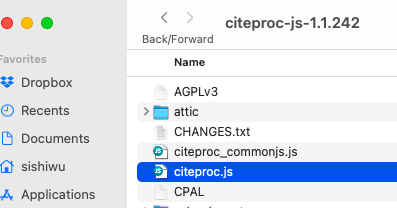
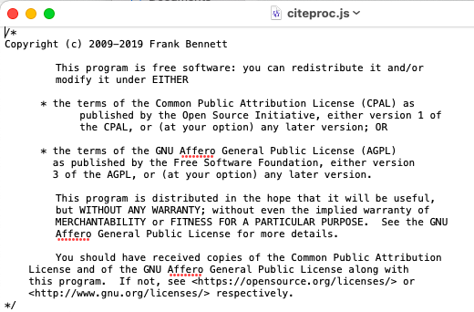
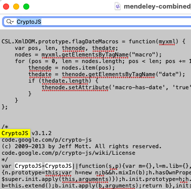

# Background

Mendeley uses [citeproc-js](https://github.com/Juris-M/citeproc-js) as its [Citation Style Language](https://github.com/citation-style-language/test-suite) (CSL) [processor](https://citationstyles.org/developers/#csl-processors) to produce fotmatted citations. However, the current version of `citeproc-js` in the latest Mendeley (as of today, `v1.19.8`) is `1.1.210` . This version lacks the support for `multi-layout`, which is an element defined in [CSL-M](https://citeproc-js.readthedocs.io/en/latest/csl-m/index.html#cs-layout-extension) (an extension to CSL) and is the key to enable Mendeley to generate citations with styles based on language. Therefore, we need to mannually update the CSL processor built-in with Mendeley to version `1.1.242` (the last one that can work with Mendeley).


# Modify `mendeley-combined.js` Mannually

1. Download the latest  `citeproc-js` that can work with Mendeley here: [citeproc-js-1.1.242.zip](https://github.com/Juris-M/citeproc-js/releases/tag/1.1.242). Uncompress the downloaded file, and open the folder, you'll see a file named `citeproc.js`. 

<p align="center">
  
</p>

2. Open this file with TextEdit or any editor app you might have, and **copy all** the text inside it.

<p align="center">
  
</p>

3. Now, back to the file  `mendeley-combined.js` (assuming you have found the file following the instructions in [README.md](README.md)). Again, open it, search for the word "CryptoJS" and you'll find something looks like this:

<p align="center">
  
</p>

Everything above it (as shown in the code block below), is the old CSL processor. Everything below it and including itself is some customization that Mendeley made and shouldn't be touched. 

```
/*
CryptoJS v3.1.2
......
```

We need to delete everything above it (more specifically, delete everything above Line 17566) and paste what we just copied into there, and **SAVE the file**. 